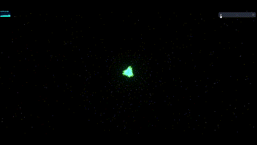
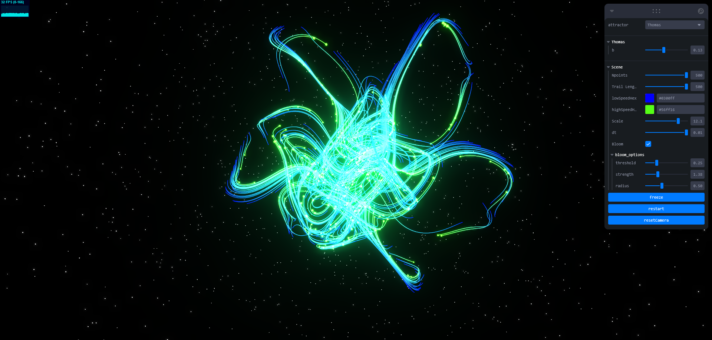
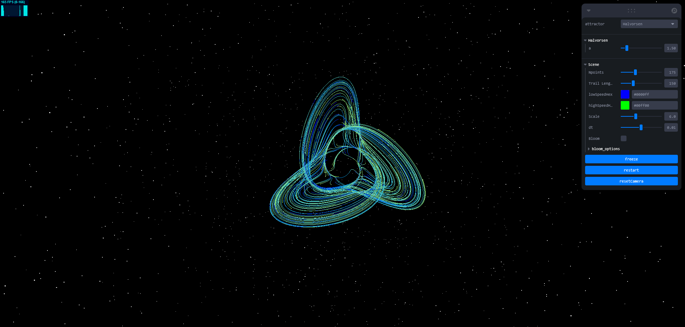
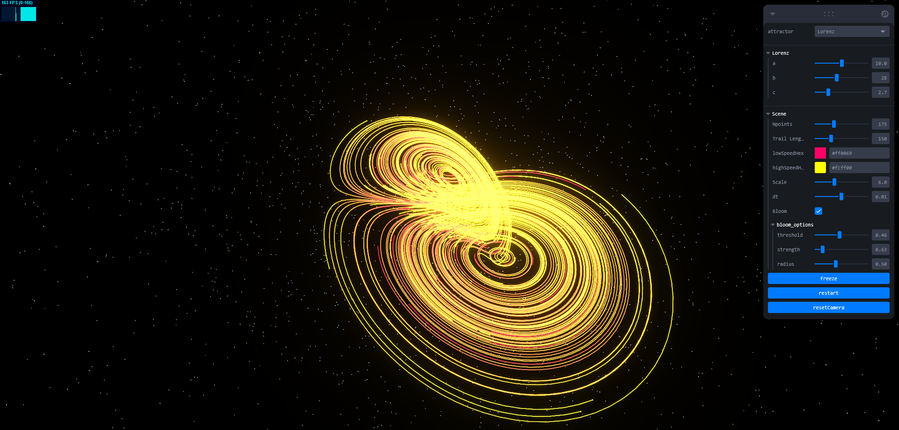

<p align="center">

</p>

# Chaos Attractors Simulation

A modern simulation engine for chaotic attractors in your browser. Chaos‐Equations renders complex chaotic systems (like the Lorenz and Halvorsen attractors) using react‑three‑fiber and Leva controls, letting you explore chaos in real time.

## Features

- **Modular Architecture:**  
  Each attractor is implemented as a separate module. Shared components like `ChaosManager`, `Particle`, and `AttractorWrapper` help reduce code duplication and improve maintainability.

- **Dynamic Simulation Controls:**  
  Leva controls allow you to adjust simulation parameters (e.g., time step, number of particles, trail length, global scaling) in real-time. Two dedicated Leva buttons let you freeze the simulation and restart it from the beginning.

- **Dynamic Simulation Controls::**  
  Real‑time parameter adjustments via Leva controls allow you to tweak time steps, particle count, trail length, scaling, and more.

- **Updated Camera Setup:**  
  The default camera parameters have been updated to use the logged values for position, field of view, near, and far, ensuring an optimal initial view of the simulation.

- **Postprocessing Effects:**  
  Includes postprocessing effects (such as UnrealBloomPass) to produce a glowing, vibrant visualization of attractor tips.

## Screenshots

<p align="center">
  
  
  
</p>

## Installation

1. **Clone the repository:**

   ```sh
   git clone https://github.com/acharlas/Chaos-Equations.git cd Chaos-Equations
   ```

2. **Build and run with Docker Compose:**

   ```sh
   docker-compose up --build
   ```

Open your browser and navigate to http://localhost:3000 to see the simulation.

## Project Overview

- **AttractorManager:**  
  Provides a UI control (via Leva) to switch between the Halvorsen and Lorenz attractors.

- **HalvorsenAttractor / LorenzAttractor:**  
  Each attractor sets up its own parameters (merged with shared controls), binds its specific chaotic equation, and passes the configuration to the ChaosManager.

- **ChaosManager & Particle:**  
  The ChaosManager spawns multiple particles, each updating its position according to the provided chaotic equation. Each particle renders a trail with a smooth gradient and a glowing tip (a customizable sphere) whose size can be adjusted.

- **AttractorWrapper:**  
  Wraps attractor components in a Three.js group that applies a global scaling factor.

Feel free to explore and tweak the controls in the Leva panel to see how different parameters affect the simulation. Enjoy your chaotic visualizations!
