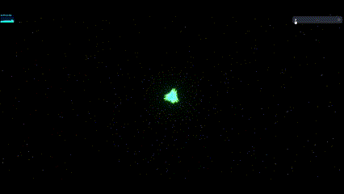
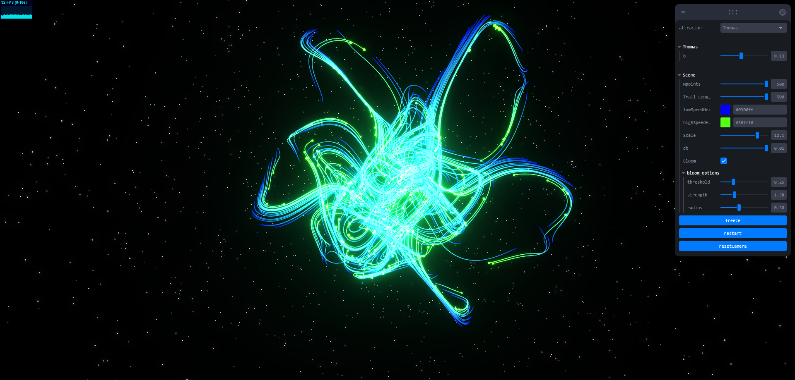
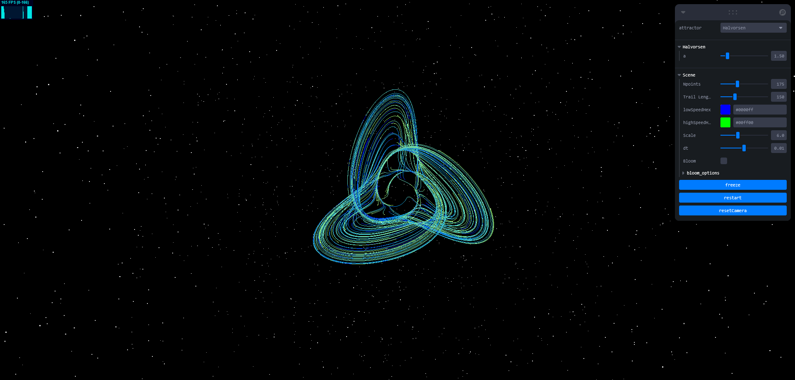
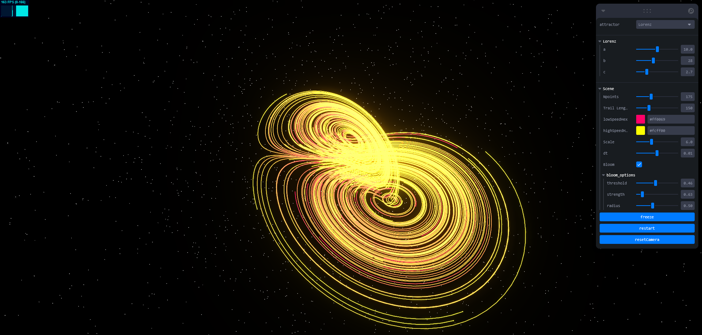

<p align="center">

</p>

# Chaos Attractors Simulation
[![React][React.js]][React-url] [![Three][Three.js]][Three-url] ![build]

Real-time chaotic-attractor visualiser running in the browser (Lorenz, Halvorsen, Thomas, …), built on `react-three-fiber` with `Leva` for the controls.

## Controls

- `Attractors`: toggle any subset of the 15 systems.
- `Simulation`: `Particles`, `Trail Length`, `Global Scale`, `Time Scale`, `Freeze`.
- `Colors`: `Low Speed Color`, `High Speed Color`.
- `Effects`: `Bloom` + `Threshold` / `Strength` / `Radius`.
- `View`: `Show Stars`.
- Actions: `Reset Camera`.

## Screenshots

| Thomas | Halvorsen | Lorenz |
| --- | --- | --- |
|  |  |  |

## Installation

```sh
git clone https://github.com/acharlas/Chaos-Equations.git
cd Chaos-Equations
npm install
npm run dev          # http://localhost:3000
```

Or with Docker Compose:

```sh
docker compose up --build
```

Sanity checks:

```sh
npm run lint
npm test
npm run build
```

## Architecture

- `src/chaos/equations.js` — pure ODE kernels (one per attractor). Rabinovich–Fabrikant is the only RK4-attractor.
- `src/chaos/attractors.jsx` — `ATRACTORS` table (id, group, scale, equation, leva params) + `AttractorView` + `AttractorManager`. Per-attractor parameter changes only require editing the table.
- `src/chaos/ChaosManager.jsx` — the simulation: per-frame integration in a `useFrame` hook, SoA particle buffers, instanced spheres + line-segments for the trails, automatic speed→colour range, moving wrap-break on the index buffer.
- `src/Scene.jsx` — `<Canvas>` wrapper, leva schemas, bloom + stars + camera controls.
- `src/App.jsx` — `<Leva>` panel + `<Scene>` + footer with author links.

## License

MIT © 2026 Axel Charlassier. See `LICENSE`.

[build]: https://img.shields.io/github/actions/workflow/status/acharlas/Chaos-Equations/deploy.yml
[React.js]: https://img.shields.io/badge/-ReactJs-61DAFB?logo=react&logoColor=white&style=for-the-badge
[React-url]: https://react.dev/
[Three.js]: https://img.shields.io/badge/Three.js-000000?style=for-the-badge&logo=three.js&logoColor=white
[Three-url]: https://threejs.org/
